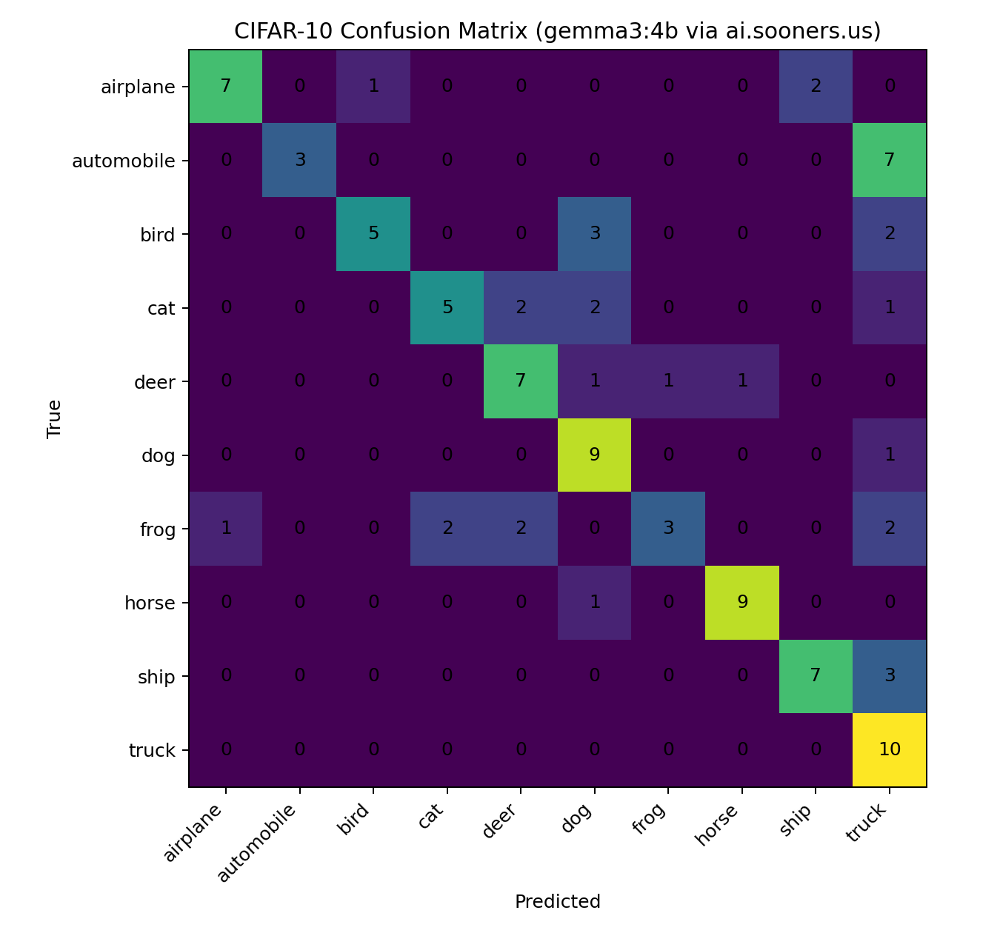
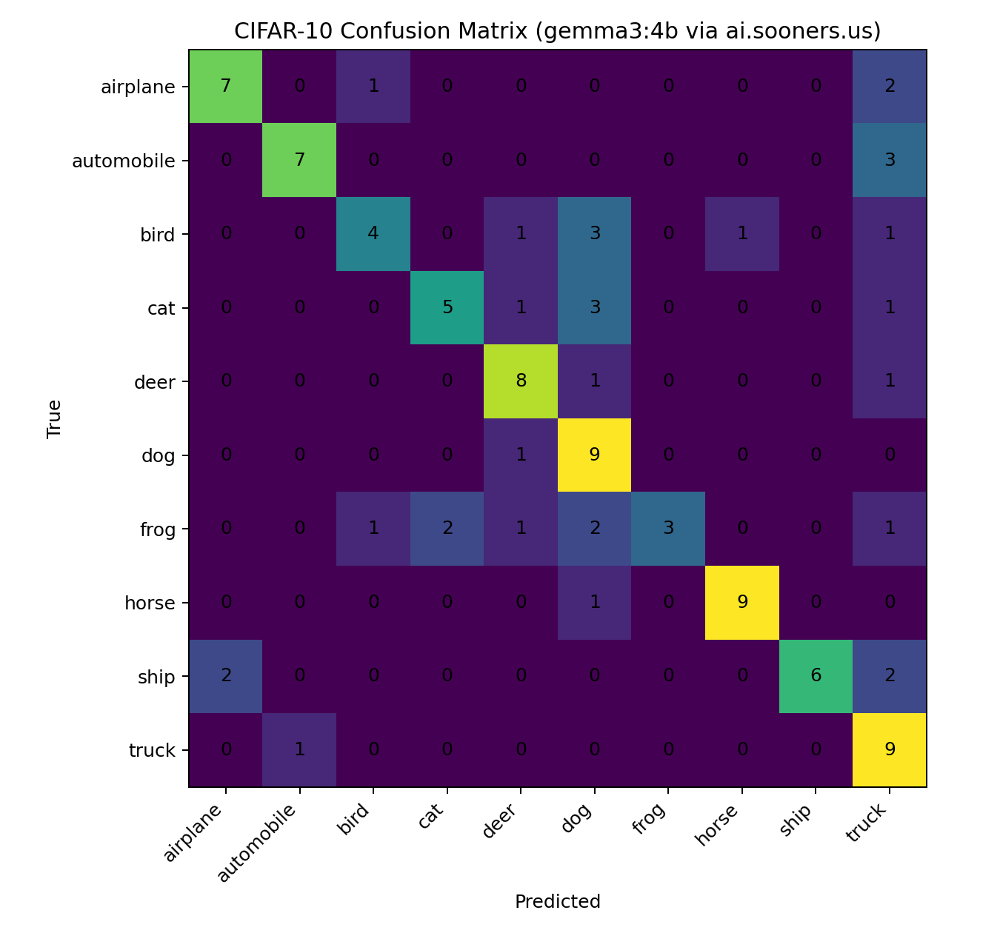
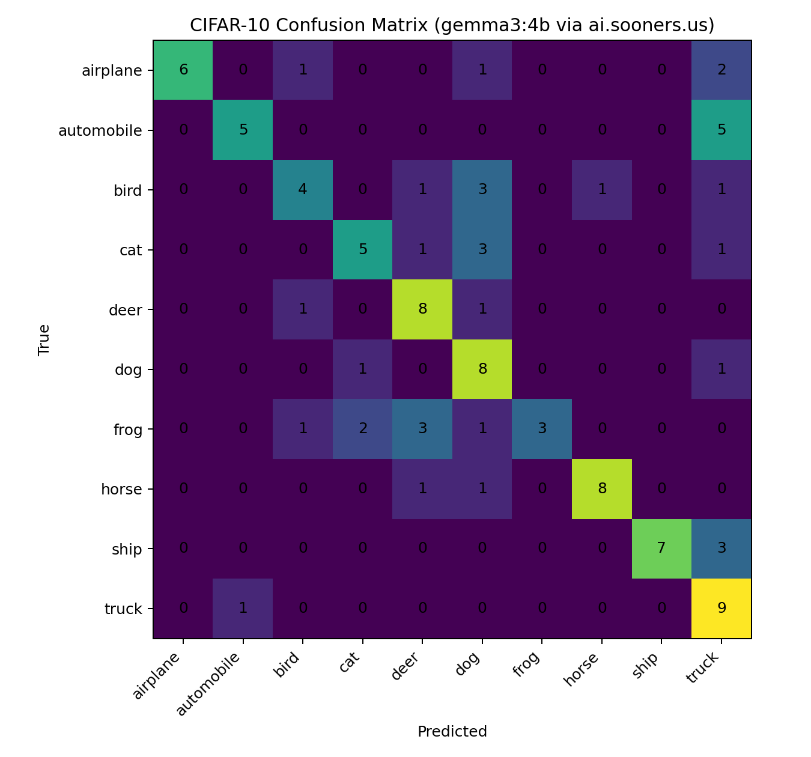

# SpongebobCLIBot
## Setup
### Account and API key
1. Visit https://ai.sooners.usLinks to an external site.

2. Click Sign up and register with your email.

3. After logging in, open Settings → Account → API Keys.

4. Create a new API key and copy it.

#### Create Local .env file
Create /.soonerai.env with:

SOONERAI_API_KEY=your_key_here
SOONERAI_BASE_URL=https://ai.sooners.us
SOONERAI_MODEL=gemma3:4b

### Python and python package installation
Install Python 3.12.1
Check Python version:
- python3 -v

Run the following commands via your terminal:
- pip install -r requirements.txt

## Run the Spongebob ChatBot
python3 spongebob_cli.py
End the conversation with "Bye"

# CIFAR10 Image Classifier

## Setup
For setup follow the same instructions as for the Spongebob CLI

## Run the image classifier
python3 cifar10_classify.py

## Analysis
### Prompt 1: You are an expert image classifier that can recognize primary objects in images you are given.

Confusion Matrix suggests this system prompt has the model classify automobiles as cars. These categories are similar enough that this makes sense. There is also some confusion between the smaller animal categories. Overall accuracy at 62%

### Prompt 2: You are an expert image classifier that can recognize primary objects in images you are given. Carefuly analyze the images you recieve and return a label that corresponds only to the main object.

Results did not change much from the previous prompt. Overall accuracy at 64%

### Prompt 3: You are an expert image classifier that can recognize primary objects in images you are given. Carefuly analyze the images you recieve and return a label that corresponds only to the main object. You can recognize the difference between different kinds of animals and vehicles.

Significant improvement in true classification of automobiles. Overall accuracy reaches 67%.

### Prompt 4: You are an expert image classifier that can recognize primary objects in images you are given. Carefuly analyze the images you recieve and return a label that corresponds only to the main object. You can recognize the difference between different kinds of small, medium and large animals as well as vehicles.

General reduction in true positive classifications for previously better categories. Overall accuracy reduced to 63%

## Conclusion
Prompt engineering can slightly improve the classification ability of the small gemma3:4b model, but verbose system prompts can confuse the model and result in reduced accuracy.

